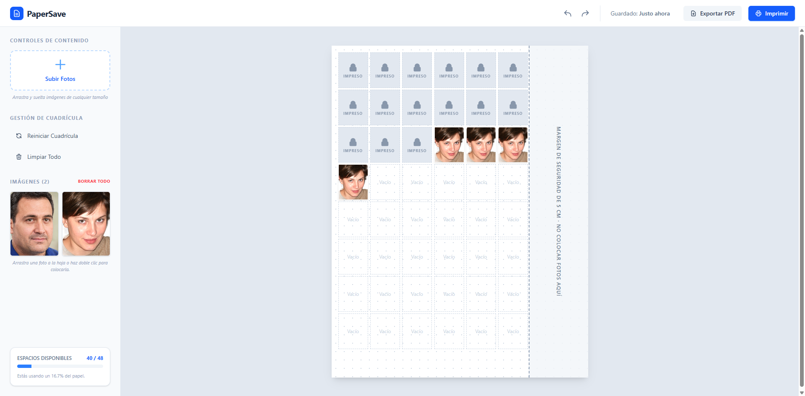

# 📸 PaperSave

> **Optimiza, edita e imprime tus fotos tamaño infantil con Inteligencia Artificial directamente en tu navegador.**

🔗 **¡Pruébalo en vivo! [PaperSave Live Preview](https://papersave-53ca5.web.app/)**

<!-- CAPTURAS: agregar aquí las imágenes de la app (ej. ) -->

PaperSave es una aplicación web progresiva (PWA) diseñada para la edición y preparación de fotografías de documentos. Su principal característica es que **todo el procesamiento de Inteligencia Artificial ocurre localmente en el dispositivo del usuario**, garantizando cero consumo de datos de red tras la primera carga, velocidad ultrarrápida y privacidad absoluta.

---

## ✨ Características Principales

- 🤖 **Eliminación de Fondo con IA (Offline):** Utiliza el modelo `isnet_fp16` para extraer sujetos con precisión milimétrica (incluso cabello). No se envían fotos a ningún servidor.
- 👱‍♂️ **Detección Facial Automática:** Usa `face-api.js` dentro de un Web Worker dedicado para detectar rostros y sugerir el recorte perfecto.
- ⚡ **WebAssembly Multihilo (Modo Turbo):** Aprovecha `SharedArrayBuffer` y múltiples núcleos del procesador para recortes y procesamientos casi instantáneos.
- 📱 **Aplicación Web Progresiva (PWA):** Instalable en escritorio y en el celular (con adaptación visual para pantallas pequeñas). Los modelos de IA pesados (~75MB) se guardan en la caché del Service Worker para funcionar 100% sin internet en visitas posteriores.
- 🗄️ **Almacenamiento Local (IndexedDB):** Tus fotos y el estado de la hoja se guardan en la base de datos de tu propio navegador y sobreviven a cierres y reinicios. Se solicita almacenamiento persistente para que el navegador no lo borre, y la hoja nunca muestra imágenes rotas si una foto falta.
- ⏪ **Historial de Acciones:** Funcionalidad de Deshacer/Rehacer (Undo/Redo) construida con Zustand y Zundo.
- 🖨️ **Exportación PDF y Soporte de Impresión:** Generación de hojas listas para imprimir generadas completamente en el cliente.
- ✅ **Control de lo ya impreso:** Pensado para llenar la misma hoja a lo largo de varios días. Tras imprimir o exportar el PDF, la app ofrece marcar las fotos como impresas (el navegador no puede saber si realmente se imprimió, por eso pregunta) y libera el espacio que ocupaban.

---

## 📖 Guía de Uso Rápido

1. **Sube tu foto:** Usa el botón "Subir Fotos" o arrastra y suelta tus imágenes en cualquier parte de la ventana. Llegan a la galería del panel lateral.
2. **Encuadre Automático:** La IA detectará tu rostro y sugerirá el recorte perfecto para una foto tamaño infantil.
3. **Eliminación de Fondo:** En el editor de recorte (botón de lápiz en la miniatura, o clic derecho → "Editar Recorte" en la hoja), haz clic en "Quitar Fondo" para aislar al sujeto con precisión gracias a la IA local. El resultado se compone sobre fondo blanco, listo para imprimir.
4. **Arma tu planilla:** Las fotos subidas llegan primero a la galería. Tú decides dónde ponerlas: arrastra una miniatura a un espacio concreto o haz doble clic para colocarla en el primer espacio libre. Dentro de la hoja puedes mover o intercambiar fotos arrastrándolas.
5. **Marca lo ya impreso:** Con clic derecho → "Marcar como impreso" el espacio se bloquea y se libera la foto (queda un recuadro con candado), para ir llenando la misma hoja a lo largo de varios días.
6. **Exporta o Imprime:** Selecciona "Exportar PDF" o "Imprimir" para generar tu documento de alta resolución listo para papel fotográfico. Al terminar, la app te pregunta si quieres marcar las fotos como impresas.

**Atajos:** `Ctrl+Z` / `Ctrl+Y` deshacer y rehacer · `Ctrl+P` imprimir · `Supr` / `Retroceso` limpiar el espacio seleccionado o bajo el cursor · `Esc` quitar la selección · arrastrar un recuadro sobre la hoja para seleccionar varios espacios.

---

## 🛠️ Stack Tecnológico

- **Framework:** React 19 + TypeScript
- **Bundler:** Vite v8
- **Estilos:** Tailwind CSS v4
- **Inteligencia Artificial:** `@imgly/background-removal` (ONNX Runtime Web) + `face-api.js`
- **Estado:** Zustand + Zundo
- **Almacenamiento:** `idb` (IndexedDB Wrapper)
- **PWA:** `vite-plugin-pwa` (Workbox)
- **Generación de Documentos:** `jspdf` + `html-to-image`

---

## 📂 Estructura del Proyecto

```text
├── 📁 public
│   ├── 📁 models
│   │   ├── 📄 tiny_face_detector_model-shard1
│   │   └── ⚙️ tiny_face_detector_model-weights_manifest.json
│   ├── 🖼️ apple-touch-icon.png
│   ├── 🖼️ favicon.svg
│   ├── 🖼️ icons.svg
│   ├── 🖼️ pwa-192x192.png
│   ├── 🖼️ pwa-512x512.png
│   └── 🖼️ pwa-maskable-512x512.png
├── 📁 src
│   ├── 📁 components
│   │   ├── 📄 CropModal.tsx
│   │   ├── 📄 DragDropOverlay.tsx
│   │   ├── 📄 DuplicateDialog.tsx
│   │   ├── 📄 Header.tsx
│   │   ├── 📄 Icon.tsx
│   │   ├── 📄 MarqueeOverlay.tsx
│   │   ├── 📄 Modal.tsx
│   │   ├── 📄 PaperSheet.tsx
│   │   ├── 📄 PhotoSlot.tsx
│   │   ├── 📄 PrintPrompt.tsx
│   │   ├── 📄 ProcessingOverlay.tsx
│   │   ├── 📄 Sidebar.tsx
│   │   ├── 📄 SlotContextMenu.tsx
│   │   └── 📄 Toast.tsx
│   ├── 📁 config
│   │   └── 📄 constants.ts
│   ├── 📁 hooks
│   │   ├── 📄 useAppInitialization.ts
│   │   ├── 📄 useCropModal.ts
│   │   ├── 📄 useGlobalDragAndDrop.ts
│   │   ├── 📄 useGlobalShortcuts.ts
│   │   ├── 📄 useMarqueeSelection.ts
│   │   ├── 📄 usePaperScale.ts
│   │   ├── 📄 usePrintPrompt.ts
│   │   ├── 📄 useSidebarActions.ts
│   │   └── 📄 useSidebarUpload.ts
│   ├── 📁 services
│   │   └── 📄 imageProcessor.ts
│   ├── 📁 store
│   │   ├── 📄 usePaperStore.test.ts
│   │   ├── 📄 usePaperStore.ts
│   │   └── 📄 useToastStore.ts
│   ├── 📁 types
│   │   └── 📄 index.ts
│   ├── 📁 utils
│   │   ├── 📄 faceDetection.ts
│   │   ├── 📄 history.ts
│   │   ├── 📄 pdf.ts
│   │   ├── 📄 rehydrate.ts
│   │   └── 📄 storage.ts
│   ├── 📁 workers
│   │   └── 📄 faceDetectionWorker.ts
│   ├── 📄 App.tsx
│   ├── 🎨 index.css
│   └── 📄 main.tsx
├── ⚙️ .firebaserc
├── ⚙️ .gitignore
├── 📄 LICENSE
├── 📝 README.md
├── 📄 package-lock.json
├── 📄 eslint.config.js
├── ⚙️ firebase.json
├── 🌐 index.html
├── ⚙️ package.json
├── ⚙️ tsconfig.app.json
├── ⚙️ tsconfig.json
├── ⚙️ tsconfig.node.json
├── 📄 vite.config.ts
└── 📄 vitest.config.ts
```

---

## 🚀 Arquitectura y "Magia" Interna

PaperSave incluye soluciones de ingeniería avanzadas para sortear las limitaciones modernas de los navegadores:

### 1. Vite AI Middleware (`imgly-offline-magic`)

Para evitar la dependencia de CDNs externos y asegurar que la app funcione offline, los modelos de IA se empaquetan localmente. El plugin de Vite personalizado intercepta las peticiones de red hacia los binarios (`.wasm`) y fragmentos sin extensión, leyéndolos directamente de `node_modules` durante el desarrollo, y copiándolos a la carpeta `dist/` en producción de forma completamente automatizada.

### 2. Aislamiento de Origen Cruzado (Cross-Origin Isolation)

Para que la Inteligencia Artificial utilice el máximo potencial de la CPU (Multithreading), PaperSave está configurado con encabezados estrictos de seguridad que habilitan el objeto `SharedArrayBuffer`.

```http
Cross-Origin-Opener-Policy: same-origin
Cross-Origin-Embedder-Policy: require-corp
Cross-Origin-Resource-Policy: cross-origin
```

### 3. PWA con Caché Extendido

El Service Worker está configurado mediante Workbox para ignorar el límite habitual de 2MB, permitiendo cachear el motor ONNX y los fragmentos del modelo neuronal (hasta 50MB) para una disponibilidad total sin conexión.

---

## 💻 Guía de Desarrollo

### Requisitos Previos

- Node.js v20.19+ (o v22.12+) con npm.

### Instalación

1. Clona el repositorio.
2. Instala las dependencias:
   ```bash
   npm install
   ```
   _Nota: El paquete `@imgly/background-removal-data` se descarga directamente desde su tarball oficial debido a su descontinuación en los registros de NPM._

### Iniciar el servidor local

```bash
npm run dev
```

El servidor local aplicará automáticamente los encabezados de aislamiento para simular el modo turbo de WebAssembly.

### Pruebas

```bash
npm test
```

Pruebas unitarias (Vitest) del store: colocar, mover e intercambiar fotos, marcar como impreso, historial de deshacer y migración del estado guardado.

### Compilación para Producción

```bash
npm run build
```

Durante este paso, Vite:

1. Empaquetará tu código react en _chunks_ optimizados (separando la IA, la manipulación de PDF y React).
2. Copiará a `dist/` solo lo necesario para la IA sin conexión (el modelo `isnet_fp16` y el motor ONNX, ~150MB; el paquete original trae otros modelos que no se usan).
3. Generará el Service Worker pre-configurado para funcionamiento offline.

Para previsualizar la compilación:

```bash
npm run preview
```

---

## ☁️ Despliegue (Firebase Hosting)

PaperSave está configurado para desplegarse fácilmente en Firebase Hosting. El archivo `firebase.json` contiene la configuración vital necesaria para habilitar el motor neuronal multihilo.

```bash
npm run build
firebase deploy --only hosting
```

_Si actualizas la aplicación tras un despliegue y experimentas errores de carga en la IA, asegúrate de limpiar los datos del sitio en tu navegador (`F12` -> Application -> Clear Site Data) para que el Service Worker descargue las nuevas cabeceras de seguridad._

---

## ⚠️ Limitaciones Conocidas

- **Móvil:** la interfaz se adapta (panel lateral como cajón, hoja reducida al ancho de pantalla, botones compactos), pero es una adaptación visual: arrastrar fotos y el menú de clic derecho están pensados para ratón, así que en pantalla táctil se usa el doble toque para colocar una foto.
- `face-api.js` ya no recibe mantenimiento y arrastra dependencias antiguas de TensorFlow.js (`npm audit` reporta avisos de `node-fetch`, que es código de Node y no se ejecuta en el navegador). Es candidata a reemplazarse.
- La hoja es de un solo formato (Carta, cuadrícula de 6×8 fotos de 2.5 × 3 cm).
- El navegador no informa si el diálogo de impresión terminó en impresión o en cancelación, por eso marcar como impreso requiere confirmación.

---

## 🤝 Contribuir

Las contribuciones son bienvenidas. Siéntete libre de abrir un _Issue_ o enviar un _Pull Request_ si deseas mejorar los algoritmos de recorte, añadir nuevos tamaños de fotografía o mejorar la accesibilidad de la interfaz.

---

## 🙌 Agradecimientos / Créditos

Una mención especial a las increíbles librerías Open Source que hicieron posible la "magia pesada" de este proyecto:

- [`face-api.js`](https://github.com/justadudewhohacks/face-api.js) creada por **justadudewhohacks** para la detección facial y cálculo rápido de encuadres dentro de un Web Worker.
- `@imgly/background-removal` por **IMG.LY** para la eliminación de fondos de altísima precisión ejecutada 100% de manera local.

---

## 📜 Licencia

Este proyecto es de código abierto (Open Source) bajo la Licencia MIT. Siéntete libre de usarlo, explorarlo, modificarlo y contribuir.

---

**Desarrollado con ❤️ usando React, Vite y mucha resiliencia contra Service Workers.**
